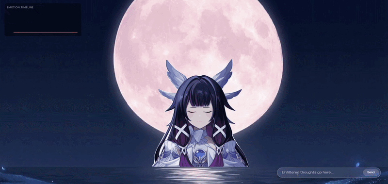

# Emote

A React + Vite app that renders an animated SVG avatar whose facial expression reflects the emotional tone of typed text in real time — driven by a hybrid three-stage pipeline (transformer classification → deterministic composite/dominance engine → an independent linguistic-cue layer), not a single sentiment call.



## What is EMOTE?

EMOTE is an experiment in text-driven facial animation. You type a message, and a layered SVG avatar's eyes and lips update to reflect the emotional tone of what you wrote — not just "positive/negative," but a set of composite emotional states (bittersweet, sarcastic, overwhelmed, and others) derived from a small deterministic engine sitting on top of a transformer classifier.

It isn't a chatbot — there's no reply generation. The focus is the perception → decision → animation pipeline: how raw text becomes a stable, non-flickering facial expression.

## Features

- **Real-time text-to-emotion interaction** — type a message and the avatar's expression updates immediately.
- **Animated SVG avatar** — layered eye/lip/body SVGs, transitions driven by GSAP.
- **Hybrid emotion pipeline** — transformer classification feeding a deterministic composite/dominance engine, not a single sentiment score.
- **Composite emotions** — 7 derived states (`bittersweet`, `disgust`, `anxious`, `frustrated`, `sarcastic`, `conflicted`, `overwhelmed`) built from the 3 base emotions, each gated behind tuned thresholds.
- **Linguistic cue detection** — an independent pattern-based layer that catches things a lexical classifier structurally can't (sarcasm, repetition-based frustration, hedged anxiety, enumeration-length overwhelm).
- **Emotion timeline** — a running visualization of the emotion field over time.
- **Web Worker inference** — model loading and every forward pass run off the main thread.
- **Debug panel (F2)** — toggleable view into the live emotion field and dominant/composite state.

## How it works

**1. Perception** (`src/ai/emotionAI.js`, `src/ai/emotionWorker.js`)
- Model: `SamLowe/roberta-base-go_emotions-onnx` — a 28-label, multi-label GoEmotions classifier run via `@huggingface/transformers`.
- Inference runs in a dedicated Web Worker so the ~260MB model load and every forward pass stay off the main thread; a synchronous direct-call fallback exists for environments without Worker support (SSR, this project's own Node test harness).
- Each of the 28 returned labels is mapped through `FORCE_MAP` into a weighted `{happy, sad, angry}` force, plus a separate hidden `edge` signal (how disgust/fear-flavored the text is) used later to disambiguate composites that would otherwise collide.
- Greeting and filler/silent-word short-circuits and a targeted-personal-attack amplifier run before the model call.

**2. Engine** (`src/engine/`)
- `emotionField.js` — applies time-based decay to the current `{happy, sad, angry}` field, then injects the new message's forces.
- `composite.js` — derives 7 composite emotions (`bittersweet`, `disgust`, `anxious`, `frustrated`, `sarcastic`, `conflicted`, `overwhelmed`) from the *normalized* base-emotion shares, each gated behind tuned thresholds in `emotionConfig.js` so two independently-strong-but-unrelated forces can't falsely saturate a composite.
- `dominance.js` — selects the single displayed emotion, requiring a composite to clear a margin over the strongest base emotion (so composites complement, not casually override, a clear base reading), with hysteresis to avoid flicker on near-ties.
- `clampEmotion.js` — a final confidence gate on transitions, especially composite → base.
- All tuning constants live in `src/config/emotionConfig.js`, with inline calibration notes explaining why each value is what it is.

**3. Linguistic cue layer** (`src/engine/linguisticCues.js`)
- A second, independent regex/pattern-based detector over the raw text, for pragmatic phenomena a lexical classifier structurally can't see: sarcasm ("oh great, ..."), repetition-based frustration ("again", "six hours"), hedged/future-conditional anxiety ("what if..."), enumeration-length overwhelm (a flat list of burdens with no strong single-clause sentiment), and somatic disgust idioms ("makes my skin crawl").
- Combined with the transformer-derived composite value via noisy-OR (`combineEvidence`), so a strong cue can stand on its own rather than being diluted by a weak transformer reading.

**4. Avatar** (`src/components/Avatar/`)
- Layered SVG eyes/lips/body, animated with GSAP.
- `emotionMap.js` — the single source of truth for which eye/lip asset each emotion uses.
- `faceMap.js` — exact positioning/sizing for each asset, aligned to the Figma source.

**State & UI**
- `src/controllers/useEmotionController.js` — owns the emotion field and dominant-emotion state; exposes `submitText` to the UI; runs a passive decay tick independent of new messages; bounds retained message history.
- `src/hooks/useEmotionHistory.js` — samples the emotion field on a steady interval for the timeline view, decoupled from how often the field itself updates.
- `App.jsx` — assembles the avatar scene, HUD (timeline + optional debug panel, toggled with F2), and chat input/message list.

## Tech Stack

- React 19 + Vite
- JavaScript
- `@huggingface/transformers` running the GoEmotions ONNX model
- GSAP for avatar animation
- Web Workers for off-main-thread inference

## Running Locally

```bash
npm install
npm run dev
```

No specific Node.js version is pinned in `package.json`; a recent LTS release is recommended.

## Testing

Two evaluation harnesses exist as standalone Node scripts (not yet wired into a test runner):

```bash
# 33-fixture regression suite over the deterministic engine
node --experimental-loader ./scripts/resolve-ext.mjs scripts/run-regression.mjs

# 266-case / 293-turn full evaluation, with per-emotion accuracy,
# confusion matrix, and false-positive/negative breakdowns
node --experimental-loader ./scripts/resolve-ext.mjs scripts/full-engine-evaluation.mjs
```

**Verified results as of this writing:** 33/33 on the regression suite; 147/266 (55.3%) on the full evaluation suite, with a full per-emotion/confusion-matrix breakdown written to `reports/evaluation-report.{md,json,csv}`.

**Important caveat on the 55.3% figure:** the full evaluation harness feeds precomputed, synthetic GoEmotions-shaped `{label, score}` arrays directly into `computeForces`/`computeEdge`, bypassing `interpretEmotion()` — and therefore the entire linguistic-cue layer — entirely. This is why `sarcastic`, `anxious`, `disgust`, and `overwhelmed` all score at or near 0% in that harness: it isn't exercising the mechanism specifically built to catch those. **55.3% is an accurate measurement of the transformer-plus-composite path in isolation, not a measurement of the live app's real end-to-end accuracy**, which also runs the cue layer on every submitted message. See the harness script's own header comment for the full rationale, and treat any future public accuracy claim accordingly.

## Known Gaps / Open Items

- `zustand` is a declared dependency (`package.json`) with no current usage found in `src/` — either dead weight to remove, or a planned piece not yet wired in.
- No automated test runner (Vitest, etc.) — both harnesses above are run manually via `node --experimental-loader`.
- No coverage exists yet for the React/UI layer itself (`Avatar.jsx`, `MessageList.jsx`, `EmotionInput.jsx`, `EmotionTimeline.jsx`, `EmotionDebug.jsx`).
- The full evaluation harness does not yet exercise the linguistic-cue layer end-to-end (see caveat above) — a version that routes fixtures through `interpretEmotion()` would give an honest end-to-end number.

## License

Original source code created for EMOTE is provided under the
[EMOTE Source-Available License](LICENSE).

The license permits the source code to be studied, referenced, and
modified for personal, non-commercial educational purposes.

Commercial use, redistribution, repackaging, sublicensing, or substantial
reuse of the source code to create another application or product
requires prior permission from the copyright holder.

### Third-Party Assets

The source-code license does not grant rights to third-party characters,
artwork, images, logos, trademarks, or other intellectual property
included in the project.

The current EMOTE demonstration uses visual assets based on third-party
intellectual property associated with Genshin Impact / HoYoverse. This
includes the avatar artwork under `public/svg/` (`eyes/`, `lips/`,
`body.svg`, `skin.svg`) and the background images
(`public/background-columbina.png`, `public/background-columbina.avif`).
EMOTE does not claim ownership of that third-party intellectual property.

Third-party software, models, libraries, and assets remain subject to
their respective licenses and terms.